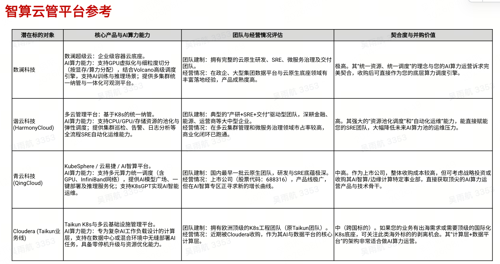

# 智算云平台与 K8S 服务商线索

> Source: 用户粘贴文本与图片（Codex clipboard，图片文件见 `raw/assets/2026-08-12-智算云平台参考.png`）
> Collected: 2026-08-12
> Published: Unknown

## 用户提供的文本

目前CNCF认证的K8S服务商有
1、上海道客网络科技有限公司-DaoCloud
2、软通动力信息技术
3、软通云
4、麒麟软件
5、成都精灵云科技有限公司
其他都是大厂，如阿里云、腾讯云这些
还有一些专门做技术外包的
1、武汉安桢瑞网络科技有限公司
2、山东白格服务外包集团
3、软通动力
*星宇智算*

## 图片

图片表格提及：数澜科技、谐云科技（HarmonyCloud）、青云科技（QingCloud）、Cloudera（Taikun 业务线）。
