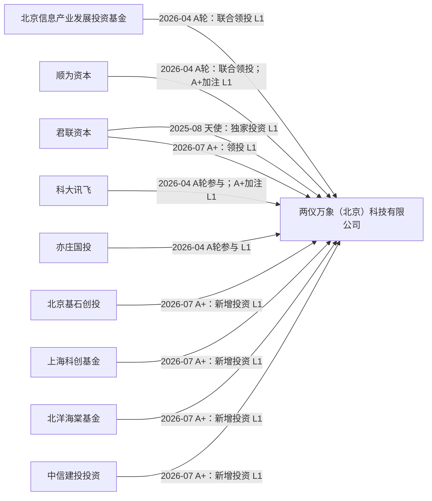
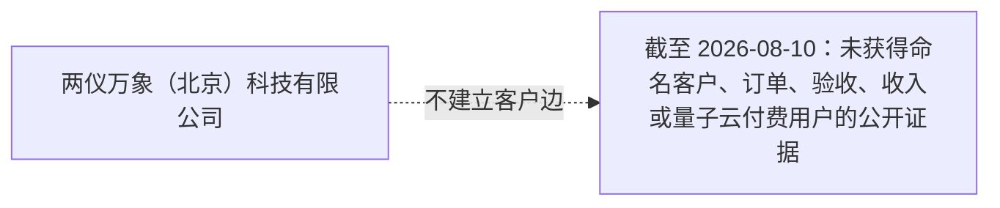
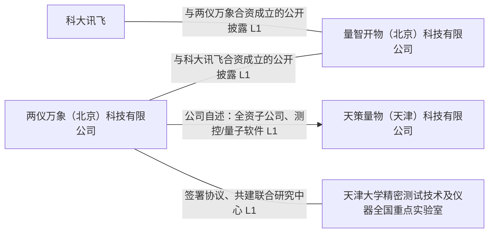
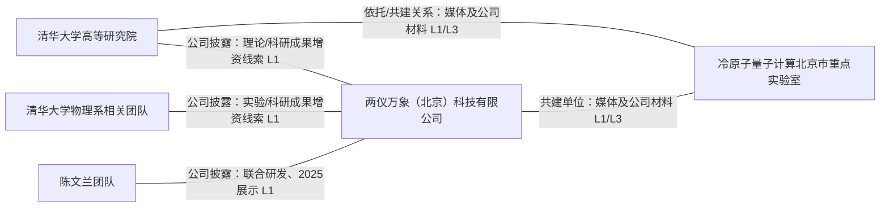
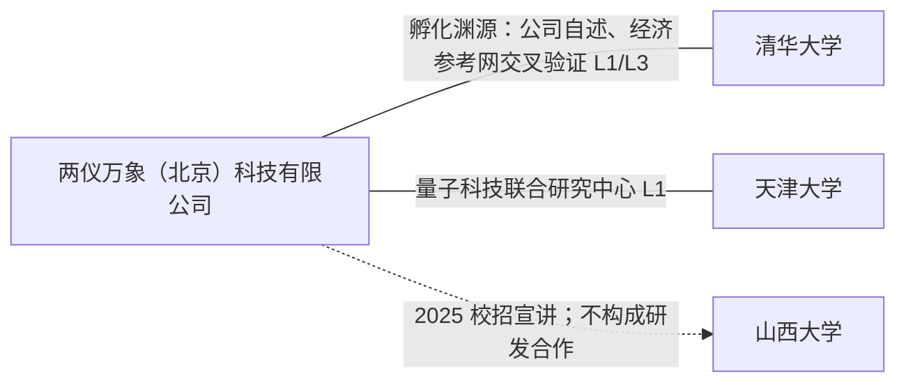

# 两仪万象（北京）科技有限公司（Qosmos）横纵分析报告

> 研究截止日：2026-08-10  
> 研究对象：两仪万象（北京）科技有限公司；品牌/官网名称：两仪万象、Qosmos  
> 研究目的：为人形机器人公司的投资、并购、合作和技术布局提供初筛判断  
> 重要边界：本报告只研究上述法定主体。清华大学相关团队、量智开物、天策量物、科大讯飞及投资方均为独立主体；除非有明确的权属或合并范围文件，不能把它们的技术、融资、合同、收入或资产计入两仪万象本体。

## 一、结论先行

两仪万象是一家由清华大学原子量子计算团队孵化的**中性原子／冷原子量子计算整机与核心器件产业化公司**。截至截止日，公开资料较强地支持其拥有明确的研发组织、连续融资、校企成果出资线索和工程化意图；清华相关作者的论文也独立展示了大规模光镊原子阵列与光腔实验进展。

但这不是一家已经被公开证据证明具备可规模销售量子计算能力的公司。其本体层面的整机出货、可用逻辑比特、纠错循环、门保真度复现、可用性、客户验收、云平台/SDK、订单、收入、毛利与供应链可靠性均未形成公开闭环。物理原子数量、光镊数量、论文作者关联和融资新闻不能替代这些商业与工程证据。

对人形机器人公司而言，本标的**不应进入训练算力、在线 VLA 推理、关节控制或近期关键 BOM 的技术路线**。当前可讨论的是低成本的研究合作或小额战略期权；不建议在未穿透技术/IP 权属、合资/子公司治理和整机工程状态之前进行控制权并购。

## 二、研究口径、证据等级与主体边界

### 2.1 主体识别

官网“关于我们”页显示“两仪万象（北京）科技有限公司”成立于 2024 年，称其孵化自清华大学原子量子计算团队，专注原子量子计算整机、核心器件、算法与软件生态；官网页脚亦使用该法人名称。[公司关于我们页](https://www.qosmos.cn/about)｜[本地留存原文](../raw/sources/2026-08-07-qosmos-官网关于我们.md)

2026 年 7 月的经济参考网报道亦写到，清华原子量子计算团队于 2024 年 7 月孵化成立两仪万象科技有限公司。该报道可用于交叉验证孵化关系，但不替代工商档案，也不证明清华的全部科研成果已经转移至公司。[经济参考网，2026-07-08](http://www.jjckb.cn/20260708/55b8712526244262a0e929695eb67a88/c.html)

### 2.2 本报告的证据等级

| 等级 | 含义 | 本报告如何使用 |
|---|---|---|
| L1 | 目标公司官网、公司新闻或其公开材料 | 可证明“公司如此披露/主张”；不自动证明第三方验收、可交付或独立优于同业。 |
| L2 | 可追溯的独立一手技术材料，例如论文原文 | 可证明论文所载实验结果；若作者、专利和公司之间没有权属文件，不证明成果属于公司资产。 |
| L3 | 独立媒体原创报道 | 用于交叉验证事件和时间，不将活动报道升级为商业事实。 |
| L4 | 投资方观点、峰会发言、宣传性转述 | 仅反映说话者判断或预期，不能作为性能、收入、市场地位的独立证据。 |
| 未获得 | 截止日未找到可核验公开材料 | 写为“未获得公开证据”，不等同于事实不存在。 |

### 2.3 三条必须保持的隔离线

1. **科研成果与公司资产**：公司 2026 年 2 月新闻称清华高研院和物理系联合团队的“原子量子计算”科研成果完成增资入股；但公开材料没有披露成果清单、估值、专利号、软件著作权、排他性或后续改进归属。因此不能将所有清华相关论文直接记为公司 IP。[公司新闻 API 留存](../raw/sources/2026-08-07-qosmos-官网新闻API.json)
2. **公司与量智开物（北京）科技有限公司**：两仪万象与科大讯飞合资成立量智开物（北京）科技有限公司的启动被双方相关活动材料披露；其算法、产品、收入和资产不应并入两仪万象，且公开资料未披露股比、董事会、排他条款与正式产品。[公司新闻 API 留存](../raw/sources/2026-08-07-qosmos-官网新闻API.json)
3. **公司与天策量物**：A 轮新闻将天策量物（天津）科技有限公司称为全资子公司、方向为测控系统和量子计算软件；本报告仅按公司自述记录，尚未以工商穿透或合并报表确认其持股及资产边界。[公司新闻 API 留存](../raw/sources/2026-08-07-qosmos-官网新闻API.json)

## 三、纵向分析：一条从实验室走向工程整机、但尚未穿过商业验证的路径

### 3.1 2024：从清华团队孵化，起点是中性原子路线而非 AI 算力

公司的公开定位不是 GPU、AI 集群或模型服务，而是以光镊囚禁超冷原子阵列为核心的量子计算。官网称公司成立于 2024 年；A 轮新闻将其表述为 2024 年 7 月由“清华大学原子量子计算团队”孵化。经济参考网在 2026 年活动报道中作了同方向表述。[公司关于我们页](https://www.qosmos.cn/about)｜[经济参考网](http://www.jjckb.cn/20260708/55b8712526244262a0e929695eb67a88/c.html)

这一出身解释了它现在的长处和限制。长处是理论、实验和产业化之间存在明确的协同叙事；限制是研发成果、人员、实验设备和 IP 的真实归属不能由“孵化”二字自动推导。对潜在投资人而言，资产边界而不是技术故事，是第一优先级尽调项。

### 3.2 2025：从联合展示走向产品化叙事，工程 SKU 仍未清晰

2025 年 9 月，公司新闻称与清华大学陈文兰团队联合研发的原子量子计算机亮相浦江创新论坛，并称实现“225 比特无缺陷可编程阵列”、支持千比特级扩展。这是一条 L1 联合研发/展示披露：它能支持公司正在把实验路线包装为整机方向，不能证明该数字是量产 SKU、已售产品的可用逻辑比特或经第三方复现的门性能。[公司新闻 API 留存](../raw/sources/2026-08-07-qosmos-官网新闻API.json)

公司产品页目前列出四个产品族：原子量子计算机、量子测控系统、量子软件与云平台、衍生产品和服务。页面把“数百比特可编程阵列、支持千比特扩展”“FPGA 原子阵列测控反馈”“78,400 个高质量光镊”等作为技术主张。页面没有对应公开 SKU、配置单、价格、保修/可用性条款、下载 SDK、API 文档、云账户入口或命名客户；因此这些内容应被读作研发及产品路线披露，而不是已验证的市场供给。[公司产品页](https://www.qosmos.cn/products)｜[本地留存原文](../raw/sources/2026-08-07-qosmos-官网产品中心.md)

### 3.3 2025 年 8 月至 2026 年 2 月：天使轮和技术成果增资，资本与技术权属开始交错

公司 2026 年 2 月新闻回溯称：2025 年 8 月获得“数千万元”天使轮融资，由君联资本独家投资；此后，清华高研院和物理系联合团队的“原子量子计算”科研成果完成增资入股。新闻还描述“高研院理论—物理系实验—公司产业化”的“三驾马车”。[公司新闻 API 留存](../raw/sources/2026-08-07-qosmos-官网新闻API.json)

该事件对投资判断的积极含义，是存在从论文和实验走向公司资本化的正式动作线索；消极含义同样重要：未披露具体知识产权、成果评估、出资比例、无形资产入账、后续改进归属或清华保留权利。因而不能据此写成“公司拥有清华团队全部原子量子计算技术”。

### 3.4 2026 年 4 月至 7 月：三轮资本推进，产业协作扩张快于商业验证

2026 年 4 月，公司宣布“亿级 A 轮”，由北京信息产业发展投资基金和顺为资本联合领投，科大讯飞、君联资本、亦庄国投参与；资金用途被披露为整机集成化攻关、核心技术、产业生态和应用场景探索。同一新闻把量智开物和天策量物列为生态布局的一部分。[公司新闻 API 留存](../raw/sources/2026-08-07-qosmos-官网新闻API.json)

2026 年 4 月 22 日，公司新闻称量智开物（北京）科技有限公司正式启动，并描述其为两仪万象与科大讯飞合资成立。这里的可确认事项是“合资启动的公开披露”；不能确认的是两仪万象在合资公司的比例、控制权、研发/客户资源的归属和是否已经商业化。[公司新闻 API 留存](../raw/sources/2026-08-07-qosmos-官网新闻API.json)

2026 年 5 月，公司与天津大学精密测试技术及仪器全国重点实验室签署协议、共建量子科技联合研究中心，披露的合作方向为光电子、激光、光学微加工、核心元器件、平台共享和研究生联合培养。这是有边界的研发合作，不等于独占技术许可、供应合同或收入。[公司新闻 API 留存](../raw/sources/2026-08-07-qosmos-官网新闻API.json)

2026 年 7 月，公司宣布“数亿元 A+ 轮”，君联资本领投，北京基石创投、上海科创基金、北洋海棠基金、中信建投投资新增；顺为资本、科大讯飞持续加注。新闻中的“国际领先”“链主企业”“全栈自研”等为公司或投资方观点，未作为独立事实采用。[公司新闻 API 留存](../raw/sources/2026-08-07-qosmos-官网新闻API.json)

### 3.5 融资历史：只保留公告原文的模糊金额

| 时间 | 轮次与金额原文 | 公开披露的投资方关系 | 证据边界 |
|---|---|---|---|
| 2025-08（后续新闻回溯） | “数千万元”天使轮 | 君联资本独家投资 | L1；未披露投后估值、股份比例、交割与现时股东名册。 |
| 2026-04-08 | “亿级 A 轮” | 北京信息产业发展投资基金、顺为资本联合领投；科大讯飞、君联资本、亦庄国投参与 | L1；不得换算为精确金额或与其他轮次相加。 |
| 2026-07-19 | “数亿元 A+ 轮” | 君联资本领投；北京基石创投、上海科创基金、北洋海棠基金、中信建投投资新增；顺为、科大讯飞加注 | L1；是轮次报道关系，不是完整 cap table。 |

**累计融资额：未披露。**“数千万元”“亿级”“数亿元”不能在没有口径的情况下相加为一个精确融资总额，也不能据此反推估值。

### 3.6 论文提供了研究能力证据，但不是公司商用能力的证明

清华相关作者的两篇 arXiv 论文给出较直接的实验层证据：

- [《Trapping 11,000 Atoms in a Tweezer Array Generated by a Single Metasurface》](https://arxiv.org/abs/2606.02715)，2026-06-01：论文摘要称稳定捕获 11,000 个原子，使用直径约 2 cm 的单一超表面，工作距离约 1.5 cm。作者中包括 Wenlan Chen、Hui Zhai。
- [《Controlling Atom Array in an Ultra-high-cooperativity Optical Cavity》](https://arxiv.org/abs/2607.04090)，2026-07-05：论文报告 \(\eta_{cav}=125\pm13\)、\(\eta_{spec}=112.3\pm3.3\)，并展示最多 16 个独立俘获原子同时耦合。
- [《Scalable defect-free assembly of large atom arrays with parallel rearrangement》](https://arxiv.org/abs/2604.08669) 与 [2022 年 FPGA/并行重排论文](https://arxiv.org/abs/2210.10364)可作为团队学术路线的历史佐证。

这些材料可支持“相关学术团队具备有竞争力的大规模原子阵列、光腔和重排研究能力”。它们不能单独支持“上述装置已是两仪万象出售的整机”“11,000 个物理原子等于 11,000 个可用量子计算比特”或“已经实现可容错逻辑量子计算”。后两项仍需整机级门保真度、纠错循环、运行时长、重复性、软件栈和客户验收资料。

### 3.7 商业化节点：公开空白本身是关键结论

截至截止日，本次核验未获得两仪万象本体的命名客户、采购订单、合同金额、交付/验收、收入、毛利、量子云付费用户、公开 SDK/API 文档、SLA 或可下载开发者套件。GitHub 名称检索出现的同名仓库没有清晰的公司身份关联，不能作为公司开源生态或软件产品证据。[GitHub 仓库检索 API](https://api.github.com/search/repositories?q=Qosmos)

因此，官网对金融、医药、人工智能、精密测量等领域的表述，只能记录为预期应用方向；泾县科普模型捐赠、校园研学、论坛展示及奖项也不是商业订单。商业结论应维持为：**工程化投入与外部融资有证据，市场闭环未获公开证据。**

## 四、五张独立关系网络

图中实线均为“公开披露的关系”，不是股权比例、控制权、收入或 IP 权属的推断。每张图分开绘制，以免把投资、合作、学术关联和客户关系混成一张伪网络。

### 4.1 投资方／轮次报道网络

边界：这张图仅来自融资新闻，**不表示当前全部股东、持股比例、董事席位或控制关系**。

### 4.2 客户／订单网络

边界：金融、医药、人工智能、精密测量是公司所述应用方向，不画为客户；科普捐赠、参访与展会不是订单。

### 4.3 产业合作网络

边界：量智开物的经营、资产、软件和客户不能并入公司；天策量物的“全资”需工商穿透；天津大学合作不证明独占许可、采购或收入。

### 4.4 技术／联合研发网络

边界：论文、人员关联和实验室共建均不等于公司独占 IP；重点实验室不是公司单独拥有的实验室，亦不能自动转化为公司产品指标。

### 4.5 高校／科研渊源网络

边界：中科大、北大等机构的参会、研学或论坛出现不建立合作关系边；只有存在明确共同研发、协议、投资、供货或任职证据时才应进入关系网络。

## 五、证据矩阵：支持什么，以及绝不支持什么

| 主张 | 结论 | 证据等级 | 可支持的范围 | 不能支持的范围 |
|---|---|---|---|---|
| 公司为两仪万象（北京）科技有限公司，2024 年成立、清华团队孵化 | 支持 | L1，孵化关系有 L3 交叉 | 主体与定位 | 工商持股、清华全部资产已转入公司 |
| 原子量子计算机、测控、软件/云、衍生服务是产品族 | 支持“官网列示” | L1 | 产品路线和公司定位 | 已售 SKU、价格、上线云服务或客户可用性 |
| 225 比特无缺陷阵列 | 联合展示的公司披露 | L1 | 当时联合研发/展示的主张 | 量产整机、逻辑比特、第三方复现或客户交付 |
| 11,000 原子捕获 | 学术实验支持 | L2 | 论文描述的原子捕获实验 | 属于公司资产、整机已销售、量子优势 |
| 光腔指标与最多 16 个原子耦合 | 学术实验支持 | L2 | 论文描述的特定光腔实验 | 商用测控模块规格、长期可靠性 |
| “数千万元”“亿级”“数亿元”三轮融资 | 支持 | L1 | 轮次的金额修饰词与参与机构 | 精确累计金额、估值、股份比例、现行 cap table |
| 与科大讯飞成立量智开物 | 支持“启动披露” | L1 | 合资关系的公开披露 | 合资比例、治理、产品、收入或其归属于母公司 |
| 天津大学联合研究中心 | 支持 | L1 | 协议与研究方向 | 独占技术、产品交付或营收 |
| 2027 年春发布第一代工程化整机 | 计划/预期 | L3 | 媒体转述的计划 | 已发布、已交付或计划必然实现 |
| 客户、订单、收入、云开发者生态 | 未获得公开证据 | 未获得 | 当前公开可验证边界 | 反证其绝对不存在 |

## 六、横向分析：同一物理路线，不能用不同证据层级做性能排名

### 6.1 对比对象与比较原则

对比选择 QuEra、Atom Computing、Pasqal 和 planqc，原因是它们均以中性原子/原子阵列量子计算作为公开技术路线或核心产品描述。[QuEra](https://www.quera.com/)｜[Atom Computing](https://atom-computing.com/)｜[Pasqal](https://www.pasqal.com/technology/)｜[planqc](https://www.planqc.eu/technology/)

本节刻意不做“谁拥有最多比特”的排行榜。不同公司公布的物理比特、阵列规模、模拟/门模型模式、错误模型、云接入与计算任务不同；更关键的是，两仪万象的公开材料多为公司新闻与联合展示，而同业的可比商业数据需要逐项在开发者入口、服务条款和客户材料中验证。没有统一基准时，参数榜会制造精确性幻觉。

### 6.2 横截面对比

| 维度 | 两仪万象 | QuEra | Atom Computing | Pasqal | planqc |
|---|---|---|---|---|---|
| 公开号称路线 | 光镊囚禁超冷原子／原子阵列 | 中性原子 | 光学俘获中性原子阵列、门模型定位 | 中性原子量子计算 | 中性原子全栈平台 |
| 当前可确认的公司层证据 | 官网产品族、融资、校企协作和工程化意图 | 官方技术与公司页面 | 官方技术与公司页面 | 官方技术页面 | 官方技术页面 |
| 已公开、可在本次材料中核验的本体客户/订单/收入 | 未获得 | 本报告未作客户财务穿透 | 本报告未作客户财务穿透 | 本报告未作客户财务穿透 | 本报告未作客户财务穿透 |
| 已公开、可在本次材料中核验的开发者接口/云服务 | 未获得 SDK/API/云入口材料 | 需在专项产品/服务尽调中逐项核验 | 需在专项产品/服务尽调中逐项核验 | 需在专项产品/服务尽调中逐项核验 | 需在专项产品/服务尽调中逐项核验 |
| 可下的谨慎判断 | 中国本土科研产业化早期标的 | 国际同路线参照对象 | 国际同路线参照对象 | 国际同路线参照对象 | 欧洲同路线参照对象 |

表中“未作穿透”不是说同行没有相应业务，而是本报告不把未核验的外部资料写成事实。对两仪万象的真正横向短板，不在于是否能展示一张更大的阵列，而在于公开材料还没回答一台机器如何被开发者调用、如何在固定任务上稳定运行、由谁付费、如何验收和复购。

### 6.3 生态位判断

两仪万象处在“有相邻学术成果、资金和工程化动员能力的中国本土中性原子产业化早期标的”位置。相对国际同路线公司，它的可能优势在于国内研究组织协同、政策/产业资本与核心器件本土化探索；短板是公司本体可验证的产品化证据不足，特别是权属、软件接口、整机可靠性、客户与收入。

这也决定了它还不能成为人形机器人公司算力供应链中的“替代 GPU”选项。量子计算路线即使未来在某些优化、模拟或测量问题上形成价值，也不是把 VLA 训练或在线推理直接迁移到中性原子机器上。

## 七、横纵交汇：它的真正资产可能是“可选权”，真正风险是“资产边界”

纵向看，公司的资本形成速度很快：从 2025 年天使轮到 2026 年 A、A+，并行推进清华成果出资、量智开物、天津联合研究中心和天津子公司叙事。横向看，中性原子赛道的门槛并不只在物理原子数；实验室结果要跨越工程化、控制系统、纠错、软件、用户任务和商业交付六道门。

因此，公司的学术渊源是一项有价值的期权，而非可直接计入交易模型的已实现经营资产。一个看似有利的早期选择——深度绑定高校实验团队——也会在并购时转化为复杂性：员工是否兼职、后续发明归谁、实验装置/数据谁持有、专利是否可独占、联合实验室成果如何分配、合资与子公司是否拥有关键模块，都会决定买方实际买到了什么。

媒体方面，科技日报 2026 年 7 月报道清华团队科研成果正被整合进公司第一代工程化整机，并预计“明年春天”发布；按报道时点该指向 2027 年春。这是值得跟踪的工程里程碑，但仍是计划，不应预先计入价值。[科技日报，2026-07-07](http://www.stdaily.com/web/gdxw/2026-07/07/content_543567.html)

## 八、面向人形机器人的行动建议

| 选项 | 当前建议 | 理由 | 允许推进的触发条件 |
|---|---|---|---|
| 直接纳入训练/推理算力路线 | 不建议 | 没有与 VLA 训练、机器人在线推理或实时控制相匹配的产品、软件和性能证据；量子硬件不是 GPU/NPU 的近端替代。 | 仅在出现针对明确机器人工作负载、可复现实验和端到端经济性时重新评估。 |
| 商业采购 | 暂不建议 | 没有公开 SKU、价格、SLA、客户验收、云入口或订单信息。 | 第一代工程化整机公开交付，提供能力边界、稳定性和支持条款。 |
| 小额研究合作/技术观察 | 可考虑 | 价值在于量子算法、量子精密测量元器件或人才交流的学习期权，金额应与研究阶段相匹配。 | 合同明确前景 IP、数据、发表、保密和退出；不将潜在量子优势写入机器人产品承诺。 |
| 战略投资 | 条件性考虑 | 可以购买“科学资产/人才/IP 选择权”，不能按短期机器人业务协同估值。 | 完成 P0 权属穿透和工程 DD；获得关键专利/代码/实验数据、融资文件、cap table 与治理权材料。 |
| 控制权并购 | 不建议 | 技术、人员、实验室、合资和子公司之间的权利义务未穿透；控制权交易可能买到不完整的资产包。 | 关键 IP/员工/许可可转移且排他，合资/子公司治理清晰，整机与商业化有独立验证后再审议。 |

### 8.1 投资或并购前的 P0 尽调清单

1. 技术成果增资的全部协议、评估报告、出资交割文件、专利/软件/数据清单、后续改进和发表权条款。
2. 清华、高研院、物理系、陈文兰团队、北京市重点实验室与公司之间的雇佣、兼职、设备使用、授权、成果归属与排他性安排。
3. 最新 cap table、历轮 SPA/股东协议、优先权、董事会席位、国资及关键投资人同意权。
4. 天策量物与量智开物的工商档案、股权、董事会、IP/人员/客户合同及与母公司的交易。
5. 第一代整机的 BOM、原子源/激光/真空/光学/测控供应链、良率、校准、运行时长、MTBF、现场维护和质量体系。
6. 能复现的系统级指标：物理比特、两比特门、测量与初始化、纠错循环、逻辑比特、可用性、程序编译/调度、基准任务与原始日志。
7. 每一笔外部订单、试用、PoC、交付、验收、回款、续费和客户依赖度；若尚无，应直接写为研发阶段，不以“场景探索”替代收入。

## 九、三种未来剧本

| 剧本 | 触发逻辑 | 可能结果 | 对机器人公司的动作 |
|---|---|---|---|
| 最可能：工程化爬坡 | 论文与融资提供研发资源，但整机还需把光学、真空、控制、纠错和软件做成重复性系统 | 第一代工程整机进入少量科研/示范验证；公司价值仍主要来自团队、工程积累与元器件能力 | 保持研究合作与季度技术跟踪，不设业务依赖。 |
| 最危险：把物理规模当成可用算力 | 大阵列、光镊或单项门指标被当成可用逻辑计算能力；可靠性、纠错和客户付费迟迟无法闭环 | 融资故事与产品现实脱节，后续轮次和人才留存承压 | 不做控制权交易；任何投资以里程碑分期、技术/IP 保证和回购/保护条款为前提。 |
| 最乐观：形成可复现实验到早期客户的桥梁 | 公开交付整机，提供可重现实验指标、软件接入、维护能力及科研/产业客户验证 | 测控、原子源、光学/精密测量元器件可能先成为商业楔子，整机长期上行 | 在权属清晰前提下考虑战略投资或联合开发，但仍把机器人核心产品路线与量子路线隔离。 |

## 十、冲突、未证实项与持续跟踪事件

| 事项 | 当前状态 | 为什么影响判断 | 下一步验证 |
|---|---|---|---|
| 清华成果“增资入股”的确切资产包 | 公司披露有事件，无公开清单 | 决定估值、并购可得资产和许可风险 | 获取协议、评估、专利/代码/数据附表及后续发明规则。 |
| 225 比特、99.5% 两比特门、千比特扩展 | 多为公司新闻或融资新闻表述 | 不等同于逻辑比特、系统级可用性或客户性能 | 要求论文/技术报告、原始日志、重复实验、纠错演示及独立评测。 |
| 11,000 原子与公司产品的归属 | 论文支持实验，权属未公开 | 学术成果不可自动转成公司整机壁垒 | 核验作者雇佣、设备/资金来源、专利申请人与授权关系。 |
| 天策量物“全资”与量智开物治理 | 仅公司新闻披露 | 决定软件、人才、客户和 IP 是否在目标主体内 | 工商穿透、章程、股东协议、关联交易和 IP 许可。 |
| 客户、订单、收入 | 未获得公开证据 | 决定从科研工程项目到商业公司的跃迁是否发生 | 逐笔核验合同、验收、回款、续费与毛利。 |
| 2027 年春第一代工程整机发布 | 媒体转述的计划 | 是近端工程化检验点 | 跟踪发布、实机演示、SKU、价格、客户与运行数据。 |

## 十一、来源清单与方法说明

### 11.1 主要来源（访问/核验至 2026-08-10）

1. [两仪万象官网：关于我们](https://www.qosmos.cn/about)（L1）；本地不可变留存：[2026-08-07-qosmos-官网关于我们.md](../raw/sources/2026-08-07-qosmos-官网关于我们.md)。
2. [两仪万象官网：产品中心](https://www.qosmos.cn/products)（L1）；本地不可变留存：[2026-08-07-qosmos-官网产品中心.md](../raw/sources/2026-08-07-qosmos-官网产品中心.md)。
3. [两仪万象官网：企业动态](https://www.qosmos.cn/businessmovement)（L1）。其中《两仪万象完成清华大学技术成果增资入股》（2026-02-05）、《两仪万象完成亿级A轮融资》（2026-04-08）、《共画量智融合新蓝图》（2026-04-22）、《量子科技联合研究中心落户天津大学》（2026-05-20）、《两仪万象完成数亿元A+轮融资》（2026-07-19）的原文已留存在[官网新闻 API JSON](../raw/sources/2026-08-07-qosmos-官网新闻API.json)。
4. [arXiv: 2606.02715](https://arxiv.org/abs/2606.02715)、[arXiv: 2607.04090](https://arxiv.org/abs/2607.04090)、[arXiv: 2604.08669](https://arxiv.org/abs/2604.08669)、[arXiv: 2210.10364](https://arxiv.org/abs/2210.10364)（L2）。
5. [经济参考网：原子量子计算科技与产业论坛相关报道，2026-07-08](http://www.jjckb.cn/20260708/55b8712526244262a0e929695eb67a88/c.html)（L3）。
6. [科技日报：冷原子量子计算北京市重点实验室揭牌，2026-07-07](http://www.stdaily.com/web/gdxw/2026-07/07/content_543567.html)（L3）。
7. 横向对象官方技术/公司页面：[QuEra](https://www.quera.com/)、[Atom Computing](https://atom-computing.com/)、[Pasqal](https://www.pasqal.com/technology/)、[planqc](https://www.planqc.eu/technology/)；仅用于路线与对象识别，不用于未经本报告逐项验证的性能/商业排名。

### 11.2 方法说明

本报告采用横纵分析：纵轴追溯主体、技术、融资、协作和商业化节点，横轴只在可比证据层级下比较同路线公司。所有估值、收入、客户、性能和股权边界均以公开材料为限；“未获得公开证据”不等于其不存在。报告不新增或改写 `raw/`、`wiki/` 内容。

## 十二、分类分析（报告最后一节）

**主类：8 其他｜标签：中性原子量子计算｜置信度：高。**  
**次类：当前不设。**

分类依据是“客户购买什么、收入由什么产品承载”。两仪万象的公开产品及研发方向是中性原子量子计算整机、量子测控、量子软件/云及相关元器件；它不是已交付的 AI GPU、TPU、NPU、CIM/PIM、光学矩阵 AI 加速器、AI 集群、AI 编译平台或模型产品。官网提及“量智融合”和人工智能应用场景，不能把量子计算主体误归入 AI 训练、AI 推理、模型类型或 AI 芯片类别。

下列分类均不成立：

- **1.9 光子／光电计算芯片**：激光、光学超表面和光腔是操控中性原子的系统组成，并非以光学矩阵运算为收入承载物的 AI 加速芯片/计算卡。
- **1.1–1.4 芯片硬件**：没有 AI GPU、TPU、NPU 或其他 AI 加速芯片的交付证据。
- **2.1–2.2 AI 编译及计算架构**：没有 CUDA-like 平台、AI 算子/迁移产品或满足开发者产品化要求的证据。
- **3.x–5.x 集群、异构调度、训练/推理框架**：没有 AI 集群、调度、训练框架或推理框架服务的交付证据；即使未来形成量子云，也不应硬归入 5.2。
- **6.x 模型类型与计算负载**：公司不是 LLM、VLA 或其他模型类型。
- **7 数据服务**：未见数据采集、标注、治理或以数据服务收费的证据。

迁移触发条件：若未来形成独立、可审计的 AI 加速硬件或软件收入，应按真实交付物重新审查对应目录；若形成量子云服务收入，在现行分类中仍应保留“8 其他”，直到新增“量子计算”稳定分类；若知识库未来建立专门的量子计算类别，再整体迁移。 
