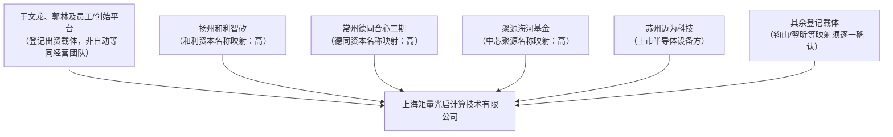
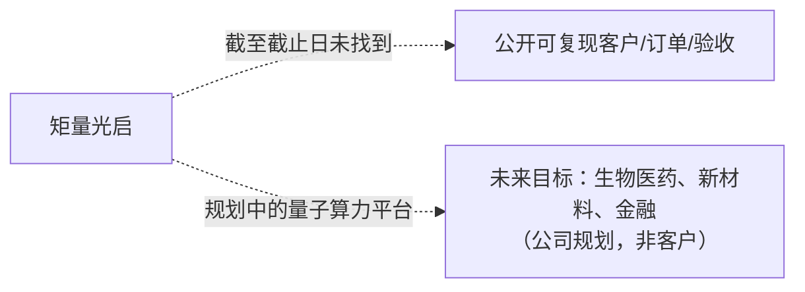
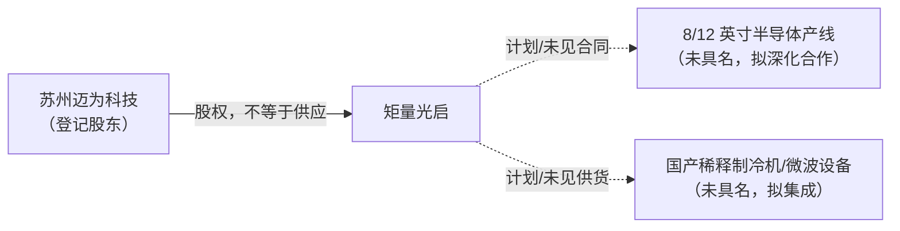
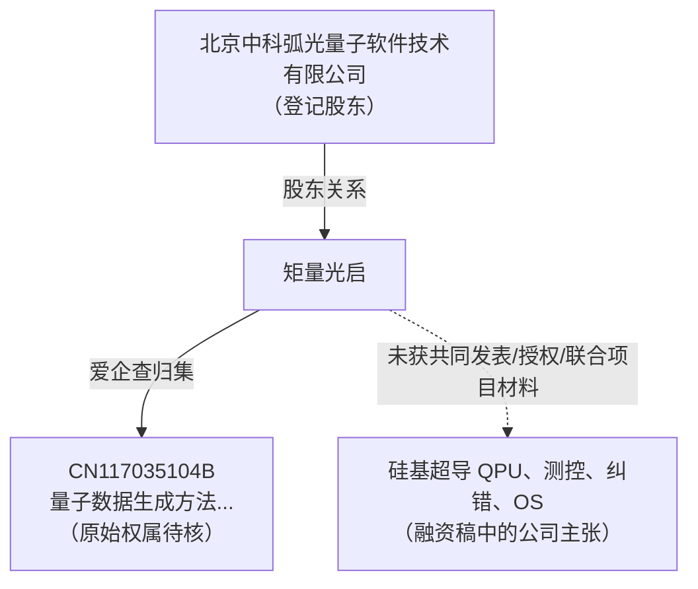
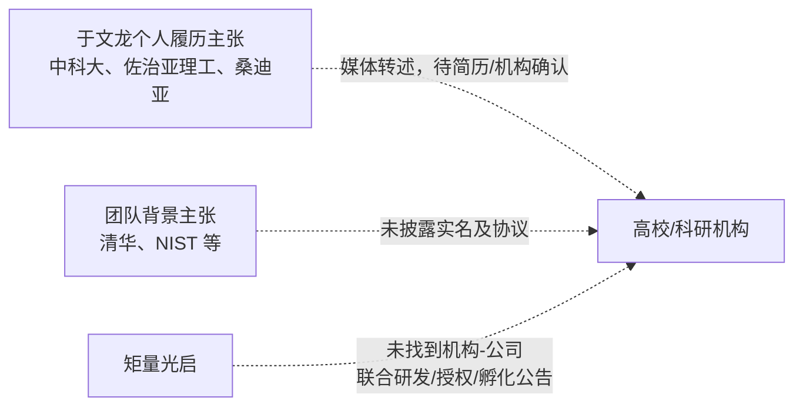

# 矩量光启（上海矩量光启计算技术有限公司）横纵分析报告

> 研究截止日：2026-08-10  
> 研究对象（唯一法定主体）：上海矩量光启计算技术有限公司，统一社会信用代码 `91310104MAENA4J85M`  
> 品牌／官网：矩量光启（SQ Computing，`sqcomputing.com`）  
> 研究用途：人形机器人公司的投资、并购与合作初筛；不构成法律、财务或技术验收意见。

## 结论先行

**矩量光启已可确认是一个成立于 2025 年 7 月、由于文龙任法定代表人及董事长/经理的上海量子计算公司；公开路线是硅基衬底的超导量子计算芯片—整机—软件全栈，而不是光计算 AI 芯片，也不是可直接纳入人形机器人训练或端侧推理的 AI 算力供应商。** 工商登记、其备案官网和两轮融资报道可以互相指向同一主体。[S1][S2][S4][S9][S10]

截至截止日，最强的正向商业线索是：公司在 2026 年 5 月对外披露 **2 亿元天使轮**，而工商在 2026 年 7 月记录了与该轮相吻合的扩股；公开稿件还称其完成过 8 英寸工业级产线流片。后两项中的技术能力、流片品质、整机状态和 ID M 全栈能力均主要来自融资传播材料，尚无数据表、芯片/量子比特指标、第三方测试、客户验收或可访问量子云可复现验证，不能升级为已量产或已商业交付事实。[S4][S9][S10]

对人形机器人公司的动作结论：

- **投资：暂不进入主项目投资或估值流程；可列为量子计算长期观察池。** 先取得晶圆、低温测控、量子比特/门保真度、纠错、整机 uptime 与第三方复测资料，才具备技术 DD 起点。
- **并购：不建议启动。** 主体成立时间短、核心 IP 的原始申请/转让链与关联子公司资产边界未闭环，且量子整机和机器人主训练/实时推理之间不存在已验证的产品协同。
- **合作：仅可在 P0 材料审阅通过后，讨论不接入机器人关键路径的离线算法探索。** 不采购、不承诺订单、不把“量超融合”写成机器人训练替代；若无可运行真机和可复现实验，连 PoC 也不应立项。

## 1. 研究范围、法定主体与证据等级

### 1.1 主体边界

本报告只把下列事项归属于 **上海矩量光启计算技术有限公司**：

| 项目 | 已核验信息 | 证据等级 | 使用边界 |
|---|---|---:|---|
| 工商主体 | 统一社会信用代码 `91310104MAENA4J85M`；2025-07-03 成立；徐汇区登记；法定代表人于文龙；注册资本 1,107.6923 万元、实缴 135 万元（爱企查页面更新时间 2026-08-01） | A | 商业数据库转引国家企业信用信息公示系统；不把注册资本或实缴资本当作融资到账额。 |
| 品牌/域名 | 公司 ICP 条目列出 `sqcomputing.com`，备案号沪 ICP 备 2026032701 号-1；域名首页自称“矩量光启 · SQ Computing”且提示官网建设中 | A/B | 证明域名与公司关联；不证明官网上未披露的产品性能。 |
| 经营许可范围 | 登记范围包含量子计算技术服务、集成电路设计/制造/销售、数据处理、仪器及软件等 | A | 经营范围是许可经营边界，不是产品、收入、产能或自有晶圆厂证明。 |
| 控股子公司 | 工商页显示本主体 100% 持有苏州矩量时代科技有限公司；该子公司成立于 2024-10-16 | A | 本报告不把该子公司的成立前资产、专利、人员、客户或收入自动并入上海主体；需单独取得权属链。 |

名称消歧结论：任务总表旧条目将其暂放为“1.9 光子/光电计算芯片（待核验）”，备注仅为“光计算芯片”。该线索已被主体、官网、融资报道和技术表述推翻：**矩量光启公开所述的是硅基衬底超导量子计算，不是光学矩阵、光电混合 AI 加速卡或光学伊辛计算。** 不能因公司名中有“光”字或量子技术存在光学分支，就迁入 1.9。[S1][S6][S9][S10]

### 1.2 证据等级

| 等级 | 定义 | 本报告的例子 |
|---|---|---|
| A | 工商/备案/股权变更等可复现登记信息，或主体自有公开页面 | 成立日期、法定代表人、工商股东、ICP 备案、官网处于建设中。 |
| B | 有署名的权威媒体原创、投资方/合作方公告或可追溯数据库条目 | 投资界、新华财经转发的融资、技术路线与规划。 |
| C | 招聘、会议、数据库标签或单方口径 | 公司招聘入口、爱企查“天使轮”标签。 |
| D | 本库旧图谱、截图或二次转载 | 原总表“光计算芯片”描述，仅作为被复核对象。 |
| E | 研究者推演、竞争比较与建议 | 机器人协同、三剧本、交易判断。 |

融资稿虽然由媒体发布，但内容中含企业/投资人引述和大量宣传性措辞；除“报道这样披露”外，均按 B 级处理。没有将其写成审计事实。

## 2. 纵向分析：从团队线索到工程化主张

### 2.1 时间线与阶段判断

| 时间 | 公开节点 | 证据与解释 |
|---|---|---|
| 2024-10-16 | 苏州矩量时代科技有限公司成立 | 后续工商页显示其为上海主体 100% 控股子公司，但时间早于母体成立。仅能说明现有集团结构中有一个早成立的子公司；不能倒推上海主体在 2024 年已经运营。[S8] |
| 2025-07-03 | 上海矩量光启计算技术有限公司成立 | A 级。于文龙任法定代表人；登记的业务覆盖量子计算、IC、软件、仪器及系统服务。[S2] |
| 2026 年 4 月左右 | 种子轮 | 投资界 5 月报道写为“上个月完成数千万元种子轮”，由千乘资本、德同资本和“知名半导体设备产业方”出资。轮次时间和金额均保留原文近似口径，未找到独立公告。[S10] |
| 2026-05-18 | 天使轮对外报道 | 多个来源披露 2 亿元天使轮；和利资本、钧山资本联合领投，中芯聚源、翌昕投资等参与，翊荣资本跟投，千乘资本、德同资本等老股东追加。[S9][S10] |
| 2026-06-26 / 07-03 | 章程修正、投资人及资本登记变更 | 工商变更记录显示章程修正案日期为 6 月 26 日，7 月 3 日注册资本从 923.0769 万元变为 1,107.6923 万元，并增加/调整多家投资载体。这是融资完成后工商落地的强证据，但不能从注册资本倒算 2 亿元现金是否足额到账。[S4] |
| 2026-08-10 | 官网仍处建设阶段 | 首页仅提供社招、校招、内推入口，未披露可订购产品、SDK、芯片数据、云入口或客户案例。[S1] |

公司当前仍属于“**资本先行、工程成果尚待独立披露**”阶段。纵轴上最重要的断点不是路线概念，而是从流片主张到可测 QPU、从样机到可用整机、从整机到外部客户持续使用的三次跨越。截至截止日，公开资料还没有穿过后两次。

### 2.2 团队：可确认治理层与尚不能确认的技术履历

工商主要人员页面列出于文龙为董事长、经理，徐帅、姜勋为董事，徐烨为财务负责人。[S5] 投资界报道称于文龙本科毕业于中国科学技术大学应用物理专业、后获佐治亚理工物理学博士，曾在美国桑迪亚国家实验室从事量子计算研究；还称负责芯片工艺的联合创始人有 NIST 经历，但没有披露姓名、论文、专利、任职日期或其与本主体的劳动/出资关系。[S10]

因此可作出的判断是：**管理和法定代表关系已经确认；团队的“海归/NIST/清华/中科大”叙事只是 B 级人才来源线索，不能据此确认某校/实验室对公司的技术授权、联合研发、IP 注入或现有工程能力。** 尽调应索取实名关键人员清单、在岗比例、竞业/出口管制状态、历史雇佣证明、专利和代码/版图权属链。

### 2.3 产品与技术演进：硅基超导量子整机命题，不等于 AI 芯片

融资报道将公司定位为“大型容错超导量子计算”，声称采用硅基衬底、可对接 8/12 英寸半导体产线，并使用 3D 堆叠、TSV、Chiplet 等工艺概念；同时称其覆盖芯片设计、多物理仿真、晶圆级制造、低噪声测控、纠错编码和量子操作系统，且已在 8 英寸工业级产线完成流片。[S9][S10]

这是一条有明确工程逻辑的路线：把超导量子比特的制造尽可能嵌入成熟半导体工艺，再将 QPU、封装、低温制冷、微波测控、编译/纠错与应用交付整合为量子计算机。它所面对的核心约束是量子比特一致性、相干时间、门保真度、串扰、封装/互连、低温布线与纠错开销；这些约束与大模型的 FLOPS、显存带宽、CUDA 兼容和机器人端侧毫秒级确定性控制不是同一问题。

但“硅基”“8 英寸”“IDM”“Chiplet”和“全栈”在本案中均未附带下列可核验物：QPU 型号与比特数、量子比特布局、单/双比特门保真度、读出保真度、T1/T2、校准时间、量子体积/algorithmic qubits、良率、稀释制冷机配置、测控清单、运行记录、第三方 benchmark、客户接入日志或定价。**因此这些应写成公司/融资稿披露的技术主张，而不是已验证产品规格。**

工商专利页当前仅列一项 `CN117035104B`，名称为“量子数据生成方法、系统、存储介质、计算机设备及终端”，公告日为 2026-02-10。[S7] 一项题名专利既不能证明超导 QPU 的核心 IP，也不足以证明该专利最初由本主体自主研发：该主体成立于 2025 年，仍需核对专利的申请日、原始申请人、发明人、权利转移、许可和与 QPU 的技术相关性。

### 2.4 商业化节点：计划与交付必须拆开

新华财经稿称，2 亿元资金拟用于扩充团队、深化 8/12 英寸产线合作、集成国产稀释制冷机和微波设备；并规划年内完成百比特量子计算机整机研发与部署，支撑纠错实验，到 2030 年攻克容错量子计算核心技术，未来搭建量子算力平台面向生物医药、新材料、金融风控等领域。[S9]

这些句子明确使用“拟”“规划”“将于”等未来时态。研究中只确认公司已公开提出目标，不确认：

1. 百比特整机已完成、已部署或由外部客户验收；
2. 8/12 英寸合作方、晶圆厂、制冷机和微波设备供应商已签约、已供货或已形成固定资产；
3. 生物医药、新材料、金融机构已成为客户，或量子云已产生收入；
4. “国内首家/国内首例”与“率先”的比较性宣传已被独立基准验证。

爱企查结构化页面截至截止日显示招投标、客户、供应商、招聘信息等条目均为 0；这不是“没有商业活动”的证明，只说明该数据库页面没有可展示记录，且与官网缺产品页共同构成公开商业验证不足的信号。[S2]

## 3. 融资历史与资本结构

### 3.1 融资历史表

| 时间 | 轮次 | 金额/投资方（保留原文） | 证据等级 | 审慎结论 |
|---|---|---|---:|---|
| 约 2026-04 | 种子轮 | “数千万元”；千乘资本、德同资本、知名半导体设备产业方 | B | 仅一篇原创媒体按“上个月”披露；未找到金额、交割日、交易文件或各投资主体公告。 |
| 2026-05-18（披露） | 天使轮 | **2 亿元**；和利资本、钧山资本联合领投；中芯聚源、翌昕投资等参与；翊荣资本跟投；千乘资本、德同资本等追加 | B | 投资界与新华财经转载相互印证报道口径；不把报道金额当作实缴现金、估值或可支配现金余额。[S9][S10] |
| 2026-07-03（工商核准） | 与天使轮相吻合的扩股/资本变更 | 注册资本由 923.0769 万元增至 1,107.6923 万元；新增/调整和利、中芯聚源相关载体等 | A | 强化“投资进入工商结构”的证据；但注册资本增长 184.6154 万元不能与 2 亿元融资额等同。[S4] |

### 3.2 投资方/股东网络（独立网络一）

工商股东页显示共有 16 名登记股东，页面当前可见的 10 名包括上海量芯智元、上海量启超维、扬州和利智矽、苏州迈为、常州德同合心二期、聚源海河、青岛正瀚久远叁号、珠海华函天工、珠海华函智元及上海翊荣共创；其中可见比例分别为 10.833333%、10.833333%、4.166672%、4.166663%、3.472219%、2.083331%、1.666663%、1.250004%、1.250004%、0.694444%。[S3]

工商变更页的变更后出资名单还包括于文龙、郭林、北京中科弧光量子软件技术有限公司、千乘二期（广州）创业投资基金、滁州启金翌鑫创业投资合伙企业、深圳前海千迎投资合伙企业等。[S4] 这可以确认这些**法定名称的投资/股权关系**，但下列映射仍需交易文件确认：

- 扬州和利智矽—和利资本、常州德同合心二期—德同资本、聚源海河—中芯聚源、上海翊荣共创—翊荣资本，名称与融资稿高度一致，暂列“高置信映射”；
- 钧山资本与青岛正瀚久远叁号、翌昕投资与滁州启金翌鑫等的名称映射并非本次取得的官方 LP/GP 穿透资料，不能据此直接断言；
- 苏州迈为科技在工商股东中出现，与融资稿“上市公司半导体设备方连续加码”描述吻合，但本报告没有取得其董事会公告/投资公告，故仅记录为股东，**不写成产线供应商、代工方或战略合作方**。

## 4. 五张独立关系网络

### 4.1 客户/订单网络（独立网络二）

| 关系对象 | 公开证据 | 判定 |
|---|---|---|
| 任何具名客户 | 未找到客户公告、采购公告、合同、验收新闻、案例页或可访问云服务 | **未证实**。不得由融资、投资方、logo、目标行业或量子计算机照片推导客户和收入。 |
| 生物医药/新材料/金融风控 | 新华财经稿称公司计划以后提供全栈技术服务 | **潜在目标市场，不是订单、合作或收入。**[S9] |
| 人形机器人公司 | 本次检索未发现关联 | **无客户/订单关系。** |

### 4.2 产业合作/供应网络（独立网络三）

公开稿描述的产业路径是“深化与 8/12 英寸半导体产线合作”和“集成国产稀释制冷机、微波设备”。缺少对手方、合同/订单、产线归属、工艺节点、良率、设备型号、验收及付款资料，只能记为供应链计划。[S9] 股东苏州迈为科技不能被自动写为公司晶圆、镀膜、设备或整机合作伙伴。[S3][S4]

### 4.3 技术/IP/联合研发网络（独立网络四）

| 事项 | 可用证据 | 边界 |
|---|---|---|
| 量子数据生成专利 | 工商数据库为本主体归集 1 项发明专利，公告号 CN117035104B | 无申请日、原始申请人、发明人及转让链材料前，不下“自研核心超导芯片 IP”结论。[S7] |
| 北京中科弧光量子软件技术有限公司 | 2026-07-03 变更后的工商出资人之一 | 只能确认股东关系；不确认该公司向矩量光启许可软件、交付量子 OS 或共同研发。[S4] |
| 全栈/IDM 技术体系 | 融资稿主张 | 需要芯片资料、EDA/版图权属、工艺 PDK、测控硬件 BOM、编译器仓库、纠错实验与整机运行记录逐项验证。[S9][S10] |

### 4.4 高校/科研渊源网络（独立网络五）

投资界的团队履历描述可用作人才 DD 线索，但不是大学、国家实验室与企业之间的正式关系证据。[S10] 截至截止日，未取得中国科学技术大学、佐治亚理工、桑迪亚、NIST 或清华对该公司联合研究、技术许可、成果转化、设备共享或投资孵化的公告。故本网络的结论是“**个人背景待核验，机构合作未证实**”。

## 5. 横向分析：真正的对手是可验证的量子系统与经典算力替代

### 5.1 竞争场景与比较口径

矩量光启并不处在光子 AI 芯片、GPU/NPU、机器人域控的竞品表中。其直接竞争面是：可交付的量子 QPU/整机/云平台，以及不同物理路线在可扩展容错量子计算上的工程能力；其商业替代面则是针对具体问题已经足够好的经典 HPC、GPU、量子模拟器和算法近似方法。

| 对照对象 | 客户购买的核心交付物 | 公开可验证程度 | 与矩量光启的差异及启示 |
|---|---|---|---|
| 矩量光启 | 公司主张的硅基超导 QPU、整机、测控/软件及未来量子云 | 融资与工商可验证；QPU指标、整机/云可用性、客户尚未验证 | 价值主张是半导体工艺可扩展性。当前最缺的是把“流片”转化为指标、整机和用户可复现实验。 |
| 量旋科技（SpinQ） | 超导量子计算机、NMR 教学机、在线实验平台、软件与场景方案 | 官网公开产品层级、在线软件及 2026 年对外部署/合作新闻 | 量旋提供了矩量光启尚未公开的产品菜单、软件接口、部署案例和场景入口；不能只比较融资额或路线概念。[S11] |
| IBM Quantum | 100+ 比特硬件访问、Qiskit、量子平台、网络及路线图 | 官网公开硬件/软件/平台、300+ 客户及伙伴、原型数等 | 不是国内同阶段可比估值标的，却是“全栈”需要公开到何种程度的国际工程标尺。IBM 的公开口径也强调量子—经典协同，而非取代所有 AI 算力。[S12] |
| 中性原子、离子阱、光量子等路线 | 不同物理平台的 QPU、控制系统及云访问 | 路线间需依比特质量、连通性、控制/冷却难度、纠错路径比较 | 对矩量光启构成长期替代技术，不能因为其并非硅基超导便从竞争图谱删除。当前没有足够公开参数，故本报告不虚构性能排名。 |
| 经典 GPU/HPC/量子模拟器 | 已可购买的训练、仿真、优化和离线计算服务 | 已形成广泛工程生态 | 对人形机器人而言，这是主替代方案：量子设备必须在明确问题上优于经典基线，才有采购理由；不能以“量子算力潜力”替代基准测试。 |

### 5.2 横向竞争位置

矩量光启的潜在差异化并非“光计算更快”，而是：若能在硅基衬底上提高超导 QPU 的制造一致性，并把封装、低温测控和纠错系统做成可扩展工程链，则有机会降低从实验室芯片到可重复系统的摩擦。这一命题成立的前提很高：晶圆工艺必须改善而非恶化量子器件指标；规模增大后的封装、线路、热负载与校准成本不能抵消收益；纠错要从演示走向可量化的逻辑性能。

它目前在横截面上明显落后于已公开产品、云接入、软件工具和部署案例的参与者。官网尚未发布产品页或开发者入口，[S1] 因而无法比较其 QPU、编译器、SDK、量子云排队、定价、故障恢复、SLA 或用户口碑。投资人背书只能解释资金和资源信号，不能替代这一产品证据链。

## 6. 证据矩阵

| 承重事实/判断 | 支持证据 | 反证、限制或缺口 | 结论等级 |
|---|---|---|---:|
| 唯一法定主体存在且与品牌关联 | 工商 UCC、ICP 备案、SQ 官网 | 官网工商字段仍未展示主体名；靠 ICP 关联闭环 | A |
| 成立于 2025-07-03，于文龙任法定代表人 | 工商基本信息 | 无 | A |
| 是超导量子计算而非光计算 AI 芯片 | 官网品牌、融资稿的多处“硅基衬底超导量子计算” | 公司尚未出具完整技术白皮书 | B |
| 从芯片到整机/应用的全栈能力 | 融资稿主张 | 无 SKU、数据表、开源/SDK、第三方验证 | B（主张） |
| 完成 8 英寸工业级流片 | 两篇融资报道 | 未具名产线、无测试/良率/晶圆可追溯材料 | B（主张） |
| 2 亿元天使轮 | 投资界、新华财经 | 未取得投资协议、银行流水、估值 | B |
| 融资已进入工商结构 | 2026-07-03 资本与股东变更 | 不能将注册资本变更等同 2 亿元实缴 | A |
| 种子轮“数千万元” | 投资界单源叙事 | 无时间、金额、投资方公告的独立确认 | B- |
| 2026 年内百比特整机部署 | 新华稿使用未来时态 | 没有完成/部署证据 | C（计划） |
| 2030 容错计算、量子云服务 | 公开规划 | 不构成现有产品或收入 | C（计划） |
| 真实客户、订单、收入 | 未找到 | 官网无案例；工商数据库无客户/招投标展示 | 未证实 |
| 8/12 英寸产线合作 | 公开“拟深化合作” | 对手方、协议、付款、量产数据缺失 | C（计划） |
| 国产制冷/微波供应关系 | 公开“拟集成” | 未具名，不能视为供应商或资产 | C（计划） |
| 于文龙的中科大/佐治亚理工/桑迪亚履历 | 投资界报道 | 未取得本人 CV 或机构资料 | B- |
| NIST/清华等团队来源 | 匿名团队叙事 | 无姓名、无单位—公司合作证据 | C |
| 核心超导 IP 已归属上海主体 | 工商数据库归集 1 项专利 | 原始申请、转让、与超导芯片关联均缺 | 未证实 |
| 苏州矩量时代可并入母体资产 | 母体 100% 控股关系 | 子公司早于母体成立；其资产/合同/IP需另行 DD | 仅股权 A |
| 面向机器人训练/推理可替代 GPU | 无 | 工作负载、编程模式、实时/可靠性均不匹配且无 benchmark | 不成立 |

## 7. 冲突与未证实事项

| 事项 | 支持线索 | 限制/反向证据 | 处理与下一步 |
|---|---|---|---|
| 旧分类“光计算芯片” | 总表截图 D 级 | 主体、官网、融资稿均指向超导量子计算 | 本报告不沿用；将分类改为 8 其他，等待产品交付证据。 |
| “国内首家”“国内首例” | 融资稿用语 | 无完整对比集合、时间窗口、第三方验证 | 不采纳为事实；要求给出可比较定义和原始产线证明。 |
| 8 英寸流片 | 融资稿 | 未见 QPU 规格、wafer map、良率、失效分析或独立测试 | P0 要求晶圆与测量原始数据。 |
| 百比特整机 | 公开规划 | 截止日没有已完成证据 | 把它作为未来触发条件，不能进入当前估值/采购。 |
| 投资方品牌与工商载体一一对应 | 报道的品牌名单、部分名称相近载体 | 钧山、翌昕等的 GP/基金穿透资料不足 | 以工商法定股东为准，索取 cap table、SPA、LP/GP 映射。 |
| 苏州子公司资产 | 100% 控股事实 | 子公司成立早于母体且无资产转让证据 | 逐项核实 IP、设备、人员、合同和债务是否已有效承接。 |
| 量子技术与 AI/机器人关系 | 媒体把量子称为“下一代算力” | 不等于可跑 VLA 训练/实时控制；无端到端 benchmark | 仅讨论离线、长期、问题限定的探索。 |

## 8. 横纵交汇：为什么“半导体工程化”既是机会也是最大 DD 点

纵向上，公司从成立到首次公开融资只有约十个月，迅速把“硅基超导+工业产线+全栈整机”包装为完整命题；横向上，成熟参与者已把硬件、软件、远程访问、教育/行业场景和部署案例拆成了用户可购买、可试用、可比较的产品。二者的差距恰好定义了矩量光启的下一阶段风险。

它的机会来自路线选择：超导量子计算若要扩展，确实无法只靠一次性的实验室样品。使用成熟晶圆、3D 互连和制造纪律去解决一致性、封装和扩产，是比“做出一个演示比特”更接近产业化的问题。历史上早期选择工业化问题，也可能在未来形成工艺、设备、良率和系统集成的复利。

但量子器件不是传统 CMOS。任何“复用半导体工艺”都必须落到量子比特质量上：介电损耗、材料界面、寄生模、微波串扰、低温封装和校准复杂度，都可能让产线化的收益晚于成本出现。故公司的最大价值和最大风险是同一个命题：**硅基制造能否同时提高可扩展性和量子性能。** 这不能由芯片照片、流片或投资人评价回答，只能由批次数据、可重复的系统实验和用户可访问的产品回答。

对人形机器人而言，这一纵横交汇还有第二层边界。机器人模型训练、仿真、视觉语言动作推理和控制闭环目前主要受 GPU/CPU、内存、互联、数据、编译器和实时系统约束；超导量子整机所需的低温环境、测控与量子编程工具并不构成可部署的机器人算力。未来若量子算法在特定组合优化、材料计算或离线科学计算上击败经典基线，可能产生间接研发价值；在那以前，把量子项目写成 AI infra 或机器人芯片协同，会混淆研发期权与生产能力。

## 9. 三剧本与触发条件

| 剧本 | 概率性判断（非财务预测） | 成立条件/触发器 | 对我方动作 |
|---|---|---|---|
| 基准：早期工程化公司持续融资与验证 | 当前最符合公开信息 | 公开百比特或其他整机原型；提供 QPU 指标、连续运行记录；明确晶圆/封装/测控供应关系；拿到研究型试用客户 | 观察并进行 P0 技术 DD；不作为机器人关键供应商。 |
| 下行：流片不能转化为可用系统，或资产/权属边界不清 | 早期硬科技常见风险 | QPU 批次指标波动大；整机延迟/故障率无法满足实验；融资款与股权/知识产权/子公司承接不闭环；长期没有可验证客户 | 停止投资和并购讨论；不签采购或排他；仅保留公开信息监控。 |
| 上行：硅基工艺实现可重复的高质量 QPU，并形成全栈科研服务 | 需要远超当前公开材料的实证 | 可信第三方复测；有可审计逻辑纠错进展；量子云/整机对外可用；具名客户付费续用；已签产线与关键设备保障；核心 IP 和团队稳定 | 重新评估少数股权投资或联合应用探索；仍以非机器人关键路径为前提。 |

## 10. 面向人形机器人公司的建议与 P0/P1 尽调

### 10.1 投资、并购、合作建议

**投资：暂缓。** 不是否定量子计算，而是当前对象尚无法回答“我们买到什么、谁在使用、性能是否可复现、资产是否完整、何时形成现金流”。人形机器人公司当前的稀缺资源更适合投入可验证的训练算力、数据闭环、推理平台、仿真和供应安全；量子计算可保留为远期期权。

**并购：不建议。** 量子整机需要一个完整技术生态，收购早期主体不能自动获得晶圆能力、低温测控、关键科研人才或 IP。子公司早于母体成立、专利原始权属待核等情况，还会放大交易的资产承接风险。

**合作：条件式观察。** 只有在公司能在明确问题上拿出“与经典 GPU/HPC/模拟器比较”的重复实验后，才考虑小额、非排他、无最低采购量的研究型课题。课题可以是量子算法可行性验证，但不接入训练、推理、控制和量产交付链路；成功标准必须是经典基线、问题规模、成本、运行时间、准确性、复现实验脚本和 IP 归属，而不是概念展示。

### 10.2 P0：交易前不可跳过的证据

1. 最新章程、完整 cap table、每个 SPV 的 GP/LP/品牌映射、投资协议、到账凭证、优先权与回购/对赌条款。
2. 上海主体、苏州矩量时代及所有关联主体的资产清单；专利申请/受让/许可、版图、软件、数据、设备、租赁、债务、员工劳动关系的逐项承接文件。
3. QPU 的型号、制造批次、晶圆编号、版图、工艺流程、良率、T1/T2、单/双比特门与读出保真度、串扰、校准漂移、失效分析及第三方复测原始数据。
4. “8 英寸流片”及任何“8/12 英寸产线合作”的合同、产线主体、工艺/设备清单、样片检测和知识产权/保密边界。
5. 完整整机 BOM：稀释制冷机、微波源/读出、线缆、控制器、屏蔽、功耗/热负载、维护周期、国产化替代与单点供应风险。
6. 可执行的系统演示：真实 QPU 远程访问、编译/校准流程、连续运行日志、故障恢复、实验复现；不接受仅 PPT、照片或模拟器。

### 10.3 P1：通过 P0 后的合作/投资深化

1. 用外部专家复做量子纠错及基准算法，比较经典模拟器/HPC 的时间、成本和正确性；把“量子优势”与“量子可运行”分开。
2. 核验至少两家付费或具备预算来源的试用方，取得合同、验收、复购/续用与客户访谈；不以高校访问、联合新闻或 logo 代替客户。
3. 核验关键技术人员的实际在岗、竞业限制、出口管制、核心代码/版图贡献和继任计划。
4. 若合作涉及机器人，限定为离线算法研究；先在无生产数据、无控制权、可退出的沙盒环境跑满预定义里程碑，再讨论任何扩大范围。

## 11. 完整来源清单与链接

| 编号 | 来源 | 类型/日期 | 用途与局限 |
|---|---|---|---|
| S1 | [矩量光启官网（SQ Computing）](https://www.sqcomputing.com/) | 公司官网，2026-08-10 访问 | 品牌、招聘入口和“网站正在开发中”；不含产品参数。 |
| S2 | [爱企查：工商基本信息](https://aiqicha.baidu.com/company_basic_68504962981794) | 工商信息聚合页，2026-08-10 访问 | UCC、成立、法定代表人、资本、经营范围、数据库零记录项；页面注明数据来源国家企业信用信息公示系统等。 |
| S3 | [爱企查：股东信息](https://aiqicha.baidu.com/company_shares_68504962981794) | 工商股权聚合页，2026-08-10 访问 | 16 名股东、可见股东比例与法定名称；不替代投资协议及基金穿透。 |
| S4 | [爱企查：变更记录](https://aiqicha.baidu.com/company_changeRecord_68504962981794) | 工商变更聚合页，2026-08-10 访问 | 2026-07-03 资本、出资和投资人变更。 |
| S5 | [爱企查：主要人员](https://aiqicha.baidu.com/company_directors_68504962981794) | 工商人员聚合页，2026-08-10 访问 | 董事长/经理、董事和财务负责人。 |
| S6 | [爱企查：网站备案](https://aiqicha.baidu.com/company_icp_68504962981794) | 备案聚合页，2026-08-10 访问 | `sqcomputing.com` 与沪 ICP 备 2026032701 号-1。 |
| S7 | [爱企查：专利信息](https://aiqicha.baidu.com/company_patent_68504962981794) | 专利聚合页，2026-08-10 访问 | 当前归集的一项 CN117035104B；原始申请与转让链待核。 |
| S8 | [爱企查：对外投资](https://aiqicha.baidu.com/company_invest_68504962981794) | 工商投资聚合页，2026-08-10 访问 | 对苏州矩量时代 100% 投资关系；不用于归属其历史资产。 |
| S9 | [新华财经：四大产业方集体押注矩量光启](https://www.news.cn/liangzi/20260518/fb5fcfdcd04944edbdb1790836a1b667/c.html) | 媒体报道，2026-05-18 | 天使轮、路线、流片和规划的披露来源；多为公司/投资方口径。 |
| S10 | [投资界：矩量光启天使轮融资](https://news.pedaily.cn/202605/563981.shtml) | 原创媒体报道，2026-05-18 | 种子轮、天使轮、团队履历和技术主张；未替代一手交易/技术资料。 |
| S11 | [SpinQ 官网](https://www.spinquanta.com/) | 竞品官网，2026-08-10 访问 | 公开产品、在线平台、部署和场景方案的横向标尺；不用于推断矩量光启能力。 |
| S12 | [IBM Quantum 官网](https://www.ibm.com/quantum) | 竞品官网，2026-08-10 访问 | 国际全栈、软件、客户和路线图标尺；不是国内可比估值或性能结论。 |

## 12. 审慎产业链分类结论

**主二级分类：`8 其他`——超导量子计算整机/可扩展量子芯片（中等主体置信；产品与交付低—中置信）。**

理由是客户理论上购买的是量子 QPU、低温测控、整机系统与相应软件/量子云服务，而不是 AI 训练/推理加速卡；公司当前公开收入承载物和已验证交付尚未充分披露，但技术定位已足以排除 AI 芯片类别。现有分类规则没有“量子计算”这一稳定二级类，故使用 `8 其他`，不为单一公司新增目录。

**不成立的分类：**

- `1.9 光子/光电计算芯片` 不成立：没有光学矩阵、光电混合 AI 加速卡、光学伊辛计算产品或相应收入证据；超导量子计算也不能因“量子”或名称含“光”而归入光计算。
- `1.1/1.2/1.3/1.4` 等 AI GPU/TPU/NPU/其他 AI 芯片架构不成立：没有以大模型训练、推理或机器人端侧任务为已验证交付/收入承载物。
- `2.1/2.2` 不成立：无符合准入条件的对外 AI 软件栈、编译器/算子迁移平台和开发者证据；量子软件/量子操作系统的宣传不等于 CUDA-like 平台。
- `3`、`4`、`5` 类不成立：未见以集群、异构调度或 AI 训练/推理开发框架为客户采购标的的证据。

**次分类：无。** 量子软件、云服务、工艺/IC 设计只是经营范围或融资稿中的系统组成，没有独立、已验证的对外产品和商业证据，故不增加次标签。

**迁移触发条件：** 若未来证明该主体实际对外销售的是光学/光电计算加速卡且客户购买计算 MAC 能力，可迁至 `1.9`；若证明主收入来自与量子硬件无关的 AI 芯片/AI 软件产品，则按实际产品、客户和收入重新分类。仅有路线图、专利、融资、展示、量子云计划或客户 logo 均不足以触发迁移。
